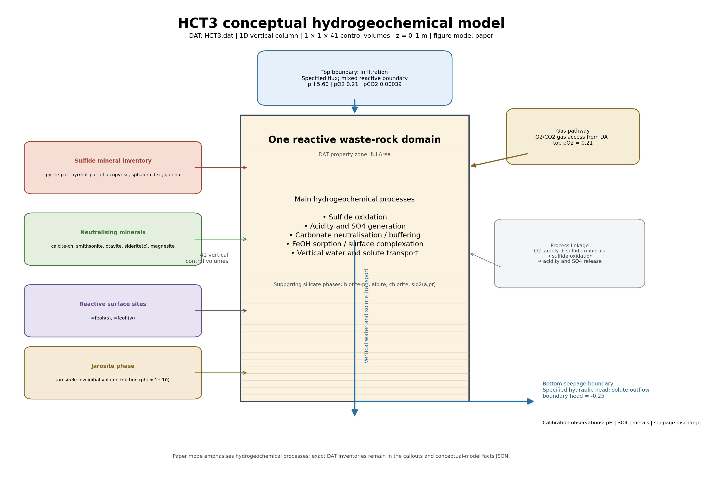
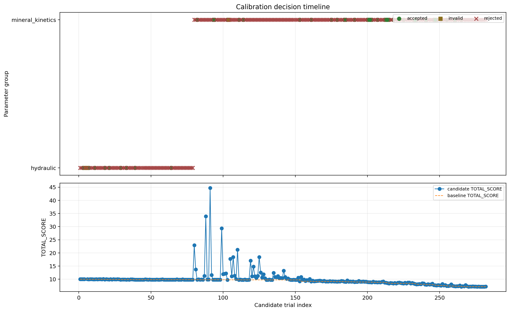
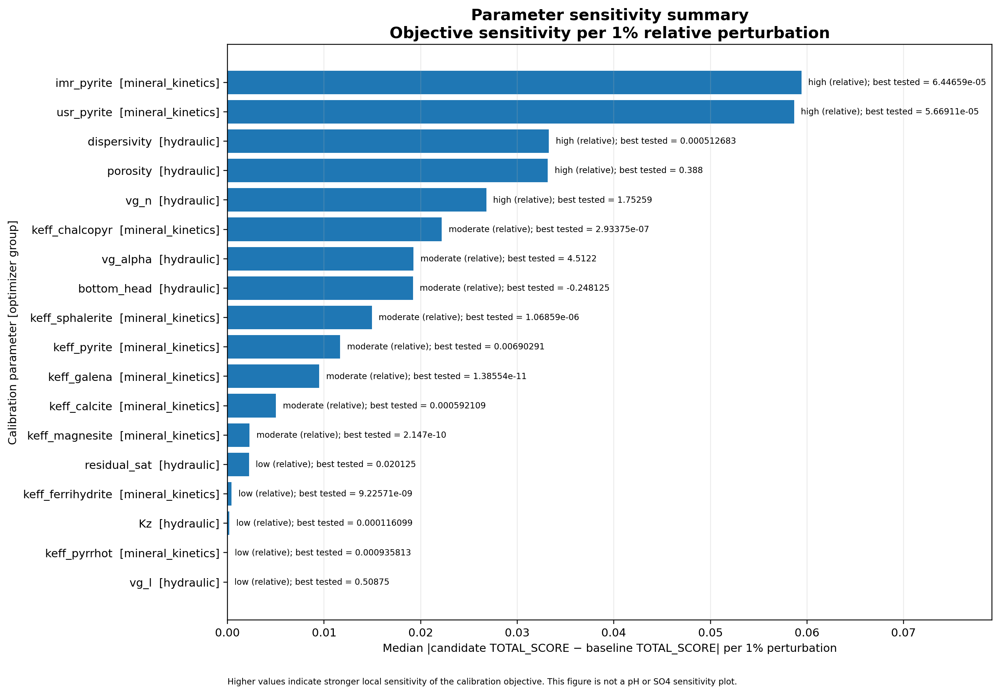

# V15.4.1 DAT-Driven Scientific Reporting, Explainability, and Campaign Review

**Generated:** 2026-08-03T14:33:19+03:00
**Project:** `HCT3`
**Report renderer:** `V15.4.2`
**Reporter mode:** read-only; no MIN3P run and no V14 optimizer-state mutation.

## Calibration story at a glance

- V14 best TOTAL_SCORE recorded in campaign evidence: `7.163816301806617`
- Candidate trials represented: `282`
- Decisions: `{"rejected": 234, "accepted": 46, "invalid": 2}`
- Candidate-level pH/SO4 response metrics available: `False`
- Decision evidence source: `C:\Dev\MIN3P-AI-Assistant\06_calibration_projects\HCT3\04_results\calibration_decision_log.xlsx`

## V15.4.2 scientific campaign review

**Review source:** `gpt + V15.4.1 deterministic correction`

### Deterministic campaign evidence

- Model runs: `247` total; `0` baseline and `281` candidate runs.
- Run status: `245` normal successes, `1` successes with retries, and `1` failed runs.
- Candidate decisions: `46` accepted and `235` rejected.
- Rollback restoration verified: `1` as a fraction of evaluated candidates.
- Objective: initial `10`; best `7.1638163`; absolute improvement `2.8361837`.
- Candidate-score range: minimum `7.1628227`, median `9.7679159`, mean `9.8752451`, maximum `44.692565`.
- Search coverage: `18` parameters in `2` groups; `281` single-parameter and `0` pair/interaction candidates.
- Step-fraction counts: `0.053424: 10, 0.026712: 10, 0.013356: 10, 0.006678: 9, 0.05: 14, 0.025: 13, 0.0125: 12, 0.00625: 11, 0.005: 70, 0.166667: 2, 0.142857: 3, 0.0714286: 2, 0.125: 2, 0.108333: 2, 0.1: 6, 0.15: 2, 0.075: 2, 0.0925898: 2, 0.0907733: 2, 0.0833333: 4, 0.0625: 2, 0.0541667: 3, 0.0270833: 3, 0.0135417: 2, 0.0462949: 2, 0.0453866: 1, 0.0416667: 4, 0.0375: 2, 0.0357143: 2, 0.03125: 2, 0.0231474: 2, 0.0226933: 1, 0.0208333: 4, 0.01875: 2, 0.0178571: 2, 0.015625: 2, 0.0115737: 4, 0.00578686: 2, 0.0113467: 1, 0.0104167: 4, 0.009375: 2, 0.00892857: 2, 0.0078125: 3, 0.00677083: 4, 0.00567333: 2, 0.00850999: 2, 0.00520833: 6, 0.0075: 14, 0.01125: 4, 0.005625: 7`.

#### Closest candidate results

| Parameter | Group | Direction | Step | Candidate TOTAL_SCORE | Candidate − baseline | Accepted |
|---|---|---|---:|---:|---:|---|
| keff_calcite | mineral_kinetics | increase | 0.005 | 7.1628227 | -0.00099358553 | False |
| imr_pyrite | mineral_kinetics | decrease | 0.005 | 7.1638163 | -0.14519967 | True |
| keff_pyrrhot | mineral_kinetics | decrease | 0.005 | 7.1736267 | 0.009810387 | False |
| keff_ferrihydrite | mineral_kinetics | decrease | 0.005 | 7.1779979 | 0.014181598 | False |
| keff_ferrihydrite | mineral_kinetics | increase | 0.005 | 7.1810968 | 0.01728045 | False |

#### Species-specific model performance

| Species | Weight | RMSE | Mean observed | Mean modelled | Bias (model − observed) | Status |
|---|---:|---:|---:|---:|---:|---|
| pH | 2 | 0.79745946 | 5.5285714 | 5.4643244 | -0.064247028 | approximately_unbiased |
| so4-2 | 2 | 0.0012042773 | 0.0046449144 | 0.0036386315 | -0.0010062829 | underpredicted |
| zn+2 | 1 | 0.00021341755 | 0.00022956634 | 0.00020878286 | -2.0783489e-05 | underpredicted |
| cu+2 | 1 | 9.6418242e-07 | 4.1120977e-06 | 4.0450002e-06 | -6.7097543e-08 | approximately_unbiased |
| pb+2 | 1 | 6.2746507e-06 | 1.5301066e-05 | 1.5256912e-05 | -4.4154709e-08 | approximately_unbiased |
| cd+2 | 1 | 2.8121418e-07 | 9.5212678e-07 | 8.9757226e-07 | -5.4554516e-08 | underpredicted |
| al+3 | 1 | 2.7354537e-06 | 1.6901408e-06 | 1.1689856e-06 | -5.2115526e-07 | underpredicted |
| ca+2 | 1 | 0.0013437842 | 0.0034008174 | 0.0027260388 | -0.0006747786 | underpredicted |

### Scientific interpretation

The campaign reduced the protected accepted objective from 10 to 7.1638163, an improvement of 28.36%. All included species RMSE values improved relative to the campaign baseline.

#### Campaign assessment

- Status: `improved`
- Confidence: `0.97`
- Direct evidence supports meaningful campaign-level improvement: the retained best score was 7.163816301806617 versus an initial score of 10.0, with 46 accepted candidates. The result should nevertheless be interpreted as a partial calibration advance rather than a fully satisfactory model fit because substantial systematic species biases remain and 279 candidates were classified as species tradeoffs.

#### Optimizer behaviour

- Implementation status: `The optimizer implementation appears operational and effective for the tested single-parameter search strategy. It accepted materially improving candidates, rejected non-meaningful improvements or degradations, and verified restoration after every candidate evaluation.`
- The objective decreased from 10.0 initially to a retained best score of 7.163816301806617.
- Forty-six of 281 candidates were accepted; therefore, the campaign was not characterized by zero accepted improvements.
- Restoration was verified for 281 of 281 candidates, corresponding to a restoration-verified fraction of 1.0.
- The closest unaccepted calcite candidate improved the incumbent score by only 0.0009935855305966967 and was rejected, consistent with a meaningful-improvement acceptance criterion rather than optimizer malfunction.
- One accepted decrease in imr_pyrite reduced the score from 7.309015975038039 to 7.163816301806617.
- Only one candidate was classified as global degradation and one as numerical instability.
- Objective metadata recorded: mode=multi_species_frozen_reference_weighted_rmse; metrics=RMSE_pH, RMSE_so4-2, RMSE_zn+2, RMSE_cu+2, RMSE_pb+2, RMSE_cd+2, RMSE_al+3, RMSE_ca+2.

Possible software issues:
- The run-accounting fields should be audited because candidate_runs and candidate_count are 281, whereas total_runs is 247; successful_runs is 245 and failed_runs is 1, which does not independently reconcile to the candidate count.
- One candidate was invalid or had a failed MIN3P run. This is evidence of an isolated execution or numerical issue, not evidence that the optimizer as a whole failed.

#### Main scientific findings

- **HIGH:** The protected best accepted model improved the composite objective and every included species RMSE relative to the campaign baseline.
  - Initial TOTAL_SCORE=10; protected best accepted TOTAL_SCORE=7.1638163.
  - Objective mode=multi_species_frozen_reference_weighted_rmse.
  - Included metrics=RMSE_pH, RMSE_so4-2, RMSE_zn+2, RMSE_cu+2, RMSE_pb+2, RMSE_cd+2, RMSE_al+3, RMSE_ca+2.
- **HIGH:** The dominant campaign outcome was species tradeoff rather than uniform model deterioration.
  - 279 of 281 candidates were classified as species_tradeoff.
  - Only one candidate was classified as global_degradation.
  - The campaign accepted 46 candidates while rejecting 235, predominantly because the total score was not meaningfully improved.
- **HIGH:** The tested search space was broad across individual hydraulic and mineral-kinetic parameters but excluded parameter interactions.
  - Eighteen parameters were tested across hydraulic and mineral_kinetics groups.
  - Both increase and decrease directions were tested.
  - All 281 candidates were single-parameter candidates.
  - No interaction or pair candidates were tested.
- **MEDIUM:** The closest rejected candidate indicates that the current incumbent may be locally insensitive to some small isolated kinetic changes under the acceptance rule.
  - Increasing keff_calcite at a 0.005 step fraction produced a score of 7.16282271627602 versus an incumbent baseline of 7.163816301806617, a change of -0.0009935855305966967, but it was not accepted.
  - Small increases and decreases in keff_ferrihydrite, keff_pyrrhot, keff_pyrite, and keff_magnesite listed among the closest candidates worsened the incumbent score.
- **MEDIUM:** The species results suggest a coupled acidity, sulfate, metal-release, and attenuation problem, but the available summary does not establish the responsible geochemical mechanism.
  - Mean modeled pH was 5.056734528405959 compared with mean observed pH of 5.528571428571428.
  - Sulfate mean modeled concentration was 0.002353440895201494 compared with mean observed concentration of 0.004644914388824444.
  - Ca was underpredicted by a relative bias fraction of -0.48300960801666254, whereas Al was overpredicted by a relative bias fraction of 1.7210141985435286.
  - The provided summary contains no process-specific diagnostic evidence that would uniquely attribute these biases to a particular mineral, transport process, or aqueous-speciation mechanism.

#### Stagnation and search-space assessment

- Local stagnation likely: `False`
- More runs with unchanged configuration recommended: `True`
- The deterministic search summary explicitly reports local_stagnation_detected as false.
- The campaign achieved retained improvement from the initial score and accepted 46 candidates, so the record does not show repeated inability to improve the incumbent.
- The closest calcite perturbation produced only a very small score reduction that did not meet the acceptance threshold, which may indicate limited local sensitivity for that isolated perturbation but does not establish a local minimum.
- All candidates were single-parameter perturbations and no interaction or pair candidates were evaluated. Thus, the principal search limitation is insufficient exploration of joint parameter effects rather than demonstrated local stagnation.
- The supplied search summary states that additional runs with the same configuration are recommended; this recommendation should be followed selectively and only after checking run accounting, objective-definition metadata, and the isolated numerical failure.

#### Numerical health

- Status: `Generally acceptable numerical health with one isolated failed run and one failed timestep requiring review.`
- There is no reported material charge-balance warning, and the reported initial charge-balance error is low. Nevertheless, the failed run and failed timestep must be traced to the affected candidate and assessed for exclusion, rerun, or numerical-setting refinement. The isolated numerical instability should not be conflated with general optimizer failure.
- One run was not successful.
- One failed timestep was recorded, and one run had retried or failed timesteps.
- The total failed-timestep count was 1; the maximum failed-step fraction was 0.001574803149606299.
- The convergence-retry fraction was 0.004048582995951417.
- No charge-balance warnings were reported. The initial charge-balance error was 0.1834207%, with the same reported first, median, and maximum absolute value.

#### Prioritized next actions

1. **Review the single invalid or failed MIN3P candidate, including its failed timestep, and rerun or exclude it using documented criteria.**
   - Reason: One failed run and one failed timestep were recorded; the campaign also explicitly flags failed_runs_present and runs_with_retried_or_failed_timesteps.
   - Expected benefit: Prevents an isolated numerical artifact from influencing inference about parameter sensitivity or tradeoffs.
2. **Use species-resolved diagnostics to identify which observations and species drive the 279 reported tradeoff outcomes.**
   - Reason: The summary establishes that tradeoffs dominate but does not identify the specific species combinations or time periods responsible for each tradeoff.
   - Expected benefit: Allows calibration decisions to target the largest structural mismatches: low pH, sulfate, Zn, Cu, and Ca predictions together with excess Al.
3. **Expand the search to scientifically justified paired or interaction candidates spanning hydraulic and mineral-kinetic controls.**
   - Reason: The campaign tested 18 parameters in both groups, but all 281 candidates were single-parameter perturbations and no interaction candidates were evaluated.
   - Expected benefit: Tests whether coupled transport-reaction adjustments can reduce the dominant species tradeoffs that isolated perturbations could not resolve.
4. **Prioritize conceptual and parameterization review of processes affecting acidity, sulfate, Ca, Al, Zn, and Cu, while retaining Pb and Cd as comparatively well-constrained mean-bias checks.**
   - Reason: The reported systematic bias pattern is underprediction of pH, sulfate, Zn, Cu, and Ca, overprediction of Al, and approximate mean unbiasedness for Pb and Cd.
   - Expected benefit: Focuses model development on the principal unresolved responses without unnecessarily disrupting species whose mean bias is already small.
5. **Continue targeted same-configuration exploration only after the above audit, using the existing acceptance rule and emphasizing promising directions rather than indiscriminate repetition.**
   - Reason: The search summary recommends additional same-configuration runs, local stagnation is reported as false, and accepted improvements were obtained. However, the closest rejected candidate shows that some very small isolated changes are below the meaningful-improvement threshold.
   - Expected benefit: May secure additional retained improvement while preserving rollback-controlled optimizer behavior and avoiding overinterpretation of negligible score changes.

#### Paper-ready conclusion

The HCT3 calibration reduced the protected accepted TOTAL_SCORE by 28.4% (10 to 7.16382). All included species RMSE values improved relative to the baseline, although systematic concentration biases remain. The remaining limitation is primarily coordinate-wise search coverage and model/process representation rather than solver instability.

The complete deterministic campaign evidence and structured review are saved as separate JSON, Excel, and Markdown artifacts.

### Campaign-review artifacts

- Deterministic analysis JSON: `campaign_analysis_V15_4.json`
- Deterministic analysis workbook: `campaign_analysis_V15_4.xlsx`
- Structured scientific review JSON: `campaign_review_V15_4.json`
- Standalone scientific review: `campaign_review_V15_4.md`

<!-- V15_LATEST_CANDIDATE_START -->
## Latest candidate explanation

**Latest candidate tested:**
keff_sphalerite increase, step 0.005000

**Why selected:**
- keff_sphalerite was active and eligible.
- It belonged to the mineral_kinetics parameter group.
- V14 selected it through the deterministic optimizer queue.
- The tested direction was increase.
- The candidate worsened TOTAL_SCORE from 7.163816 to 7.248490.

**Outcome:**
Rejected; best parameter set was retained.

**Scientific interpretation:**
The tested keff_sphalerite increase perturbation did not improve the composite calibration objective.
<!-- V15_LATEST_CANDIDATE_END -->

## Scientific conceptual model

The conceptual model is generated from the DAT file discovered in `01_input` (or selected with `--dat-file`). The facts JSON, prompt, visual draft, and generation manifest are saved in the report audit folder. The final labels, arrows, numerical grid, property-zone count, boundaries, and legend are Python-rendered from parsed DAT facts; GPT is optional and supplies only an unlabelled visual draft.

## Calibration decision timeline

Every recorded parameter trial remains visible. Rejected trials are retained as sensitivity evidence, rather than being hidden as failed calibration attempts.

## pH and SO4 response evidence

Candidate-level ΔpH and ΔSO4 metrics were not recorded in the V14 decision log. This report therefore does not create a response atlas or infer quantitative pH/SO4 effects from process theory. The objective-sensitivity evidence remains available below.

## Calibration interpretation

V14 tested hydraulic, mineral-kinetic, sorption, boundary-chemistry, and silicate-weathering parameters.
Each parameter family was evaluated using the composite `TOTAL_SCORE`; lower scores indicate closer overall agreement with the calibration targets.
Candidate-specific pH and SO4 response metrics were not stored for every parameter trial. The report therefore does not attribute measured pH or SO4 changes to individual parameter tests.

## Parameter sensitivity summary

This summary has one row for every calibrated parameter. `best tested value` is the candidate value with the lowest finite TOTAL_SCORE; it does not imply acceptance. The sensitivity class ranks local objective sensitivity relative to the other parameters in this campaign. Invalid and infinite objective values are excluded.

| Parameter | Calibration group | Process family | Hydrogeochemical process | Baseline value | Best tested value | Sensitivity class |
|---|---|---|---|---:|---:|---|
| imr_pyrite | mineral_kinetics | Sulfide oxidation | Pyrite oxidation, acid generation and sulfate release | 7.35e-05 | 6.44659e-05 | high (relative) |
| usr_pyrite | mineral_kinetics | Sulfide oxidation | Pyrite oxidation, acid generation and sulfate release | 5.71429e-05 | 5.66911e-05 | high (relative) |
| dispersivity | hydraulic | Hydraulic transport | Water residence time, gas access, solute transport and dilution | 0.0005 | 0.000512683 | high (relative) |
| porosity | hydraulic | Hydraulic transport | Water residence time, gas access, solute transport and dilution | 0.4 | 0.388 | high (relative) |
| vg_n | hydraulic | Hydraulic transport | Water residence time, gas access, solute transport and dilution | 1.7 | 1.75259 | high (relative) |
| keff_chalcopyr | mineral_kinetics | Mineral kinetics | Mineral dissolution/precipitation reaction rate | 2.2e-07 | 2.93375e-07 | moderate (relative) |
| vg_alpha | hydraulic | Hydraulic transport | Water residence time, gas access, solute transport and dilution | 4.5 | 4.5122 | moderate (relative) |
| bottom_head | hydraulic | Hydraulic transport | Water residence time, gas access, solute transport and dilution | -0.25 | -0.248125 | moderate (relative) |
| keff_sphalerite | mineral_kinetics | Mineral kinetics | Mineral dissolution/precipitation reaction rate | 9.52381e-07 | 1.06859e-06 | moderate (relative) |
| keff_pyrite | mineral_kinetics | Sulfide oxidation | Pyrite oxidation, acid generation and sulfate release | 0.00453453 | 0.00690291 | moderate (relative) |
| keff_galena | mineral_kinetics | Mineral kinetics | Mineral dissolution/precipitation reaction rate | 1.6e-11 | 1.38554e-11 | moderate (relative) |
| keff_calcite | mineral_kinetics | Carbonate neutralization | Mineral dissolution and acid neutralization | 0.000142857 | 0.000592109 | moderate (relative) |
| keff_magnesite | mineral_kinetics | Carbonate neutralization | Mineral dissolution and acid neutralization | 1.3286e-10 | 2.147e-10 | moderate (relative) |
| residual_sat | hydraulic | Hydraulic transport | Water residence time, gas access, solute transport and dilution | 0.02 | 0.020125 | low (relative) |
| keff_ferrihydrite | mineral_kinetics | Fe hydroxide sorption | Surface complexation, solute retention and reactive surface availability | 1e-09 | 9.22571e-09 | low (relative) |
| Kz | hydraulic | Hydraulic transport | Water residence time, gas access, solute transport and dilution | 0.000116335 | 0.000116099 | low (relative) |
| keff_pyrrhot | mineral_kinetics | Mineral kinetics | Mineral dissolution/precipitation reaction rate | 1.05e-05 | 0.000935813 | low (relative) |
| vg_l | hydraulic | Hydraulic transport | Water residence time, gas access, solute transport and dilution | 0.5 | 0.50875 | low (relative) |

## Parameter-trial evidence

- Full trial table: `tables/parameter_trial_effects.xlsx`
- pH/SO4 response table: `tables/pH_SO4_response_metrics.xlsx`
- Per-parameter sensitivity table: `tables/parameter_sensitivity_and_calibration_evidence.xlsx`
- Calibration-group overview: `tables/calibration_group_overview.xlsx`

### Parameter sensitivity and calibration evidence

One row is reported for every single-parameter calibration target represented in the decision log. **Median objective sensitivity per 1%** is the median absolute change in TOTAL_SCORE divided by the absolute relative parameter change in percentage points. It measures local sensitivity of the calibration objective, not pH or SO4 separately. `high`, `moderate`, and `low` are relative ranks within this campaign. A positive best ΔTOTAL_SCORE means the best tested candidate was still worse than the V14 best configuration. Invalid or infinite objective values are excluded from all sensitivity statistics.

| Parameter | Group | Trials (scored / invalid / unscored) | Median objective sensitivity per 1% | Class | Strongest direction | Best tested direction | Best ΔTOTAL_SCORE | pH response | SO4 response | Outcome |
|---|---|---:|---:|---|---|---|---:|---|---|---|
| imr_pyrite | mineral_kinetics | 28 (27 / 1 / 0) | 0.059422 | high (relative) | decrease | decrease | -0.1452 | not_available | not_available | accepted_improvement |
| usr_pyrite | mineral_kinetics | 19 (19 / 0 / 0) | 0.0586579 | high (relative) | increase | increase | 0.0870994 | not_available | not_available | accepted_improvement |
| dispersivity | hydraulic | 15 (14 / 1 / 0) | 0.0332651 | high (relative) | increase | decrease | 0.00664984 | not_available | not_available | accepted_improvement |
| porosity | hydraulic | 12 (12 / 0 / 0) | 0.03315 | high (relative) | decrease | decrease | -0.00225621 | not_available | not_available | accepted_improvement |
| vg_n | hydraulic | 12 (12 / 0 / 0) | 0.0267942 | high (relative) | increase | decrease | 0.000753442 | not_available | not_available | accepted_improvement |
| keff_chalcopyr | mineral_kinetics | 30 (30 / 0 / 0) | 0.0221766 | moderate (relative) | increase | decrease | 0.226799 | not_available | not_available | accepted_improvement |
| vg_alpha | hydraulic | 9 (9 / 0 / 0) | 0.0192526 | moderate (relative) | increase | increase | -0.00103753 | not_available | not_available | accepted_improvement |
| bottom_head | hydraulic | 8 (8 / 0 / 0) | 0.019195 | moderate (relative) | decrease | increase | 0.00418085 | not_available | not_available | no_accepted_improvement |
| keff_sphalerite | mineral_kinetics | 11 (11 / 0 / 0) | 0.0149445 | moderate (relative) | decrease | increase | 0.0846734 | not_available | not_available | no_accepted_improvement |
| keff_pyrite | mineral_kinetics | 25 (25 / 0 / 0) | 0.0116727 | moderate (relative) | decrease | increase | 0.0232354 | not_available | not_available | accepted_improvement |
| keff_galena | mineral_kinetics | 10 (10 / 0 / 0) | 0.00948833 | moderate (relative) | decrease | decrease | 0.0247251 | not_available | not_available | no_accepted_improvement |
| keff_calcite | mineral_kinetics | 37 (37 / 0 / 0) | 0.00500987 | moderate (relative) | decrease | increase | -0.000993586 | not_available | not_available | accepted_improvement |
| keff_magnesite | mineral_kinetics | 16 (16 / 0 / 0) | 0.0022848 | moderate (relative) | decrease | decrease | 0.0269706 | not_available | not_available | accepted_improvement |
| residual_sat | hydraulic | 4 (4 / 0 / 0) | 0.00221798 | low (relative) | increase | increase | 7.77281e-05 | not_available | not_available | no_accepted_improvement |
| keff_ferrihydrite | mineral_kinetics | 13 (13 / 0 / 0) | 0.000429791 | low (relative) | decrease | decrease | 0.0141816 | not_available | not_available | accepted_improvement |
| Kz | hydraulic | 10 (10 / 0 / 0) | 0.000178172 | low (relative) | decrease | decrease | -1.7969e-06 | not_available | not_available | no_accepted_improvement |
| keff_pyrrhot | mineral_kinetics | 14 (14 / 0 / 0) | 2.97074e-05 | low (relative) | increase | decrease | 0.00981039 | not_available | not_available | accepted_improvement |
| vg_l | hydraulic | 9 (9 / 0 / 0) | 2.06833e-06 | low (relative) | increase | decrease | -4.38502e-09 | not_available | not_available | accepted_improvement |

### Calibration-group overview

This table has one row per actual V14 optimizer group. It replaces the earlier mixed `Group summary`, which combined optimizer groups with conceptual process-family labels and therefore repeated `mineral_kinetics` rows.

| Calibration group | Parameters | Trials (scored / invalid / unscored) | Best candidate TOTAL_SCORE | Best ΔTOTAL_SCORE | Median candidate-minus-baseline TOTAL_SCORE | Accepted improvements |
|---|---:|---:|---:|---:|---:|---:|
| mineral_kinetics | 10 | 203 (202 / 1 / 0) | 7.16282 | -0.000993586 | 0.0941379 | 37 |
| hydraulic | 8 | 79 (78 / 1 / 0) | 9.83349 | -1.7969e-06 | 0.00689411 | 9 |

## Integrity and data-availability rules

- The reporter computes SHA-256 hashes of protected V14 inputs and state files before and after report generation.
- Protected campaign files unchanged: `True`
- Missing candidate-level pH/SO4 response data are recorded as `not_available`; the reporter does not infer numerical effects from conceptual process theory.
- This report does not run MIN3P, select candidates, change bounds, update state, or edit `agent_config.xlsx`.

<!-- V15_EXPLAINABILITY_START -->
## Why candidates were tested

V15.3.1 reconstructs candidate-selection rationale from V14 decision logs, optimizer state, transaction manifests, and GPT configuration. It is read-only and does not alter calibration state.

| # | Parameter | Direction | Step | Candidate TOTAL_SCORE | Decision | Why selected |
|---:|---|---|---:|---:|---|---|
| 271 | keff_calcite | decrease | 0.005000 | 7.249928 | reject | - keff_calcite was active and eligible. - It belonged to the mineral_kinetics parameter group. - V14 selected it through the deterministic optimizer queue. - The tested direction was decrease. - The candidate worsened TOTAL_SCORE from 7.163816 to 7.249928. |
| 272 | usr_pyrite | increase | 0.005000 | 7.250916 | reject | - usr_pyrite was active and eligible. - It belonged to the mineral_kinetics parameter group. - V14 selected it through the deterministic optimizer queue. - The tested direction was increase. - The candidate worsened TOTAL_SCORE from 7.163816 to 7.250916. |
| 273 | usr_pyrite | decrease | 0.005000 | 7.303239 | reject | - usr_pyrite was active and eligible. - It belonged to the mineral_kinetics parameter group. - V14 selected it through the deterministic optimizer queue. - The tested direction was decrease. - The candidate worsened TOTAL_SCORE from 7.163816 to 7.303239. |
| 274 | keff_magnesite | increase | 0.005000 | 7.203240 | reject | - keff_magnesite was active and eligible. - It belonged to the mineral_kinetics parameter group. - V14 selected it through the deterministic optimizer queue. - The tested direction was increase. - The candidate worsened TOTAL_SCORE from 7.163816 to 7.203240. |
| 275 | keff_magnesite | decrease | 0.005000 | 7.190787 | reject | - keff_magnesite was active and eligible. - It belonged to the mineral_kinetics parameter group. - V14 selected it through the deterministic optimizer queue. - The tested direction was decrease. - The candidate worsened TOTAL_SCORE from 7.163816 to 7.190787. |
| 276 | keff_pyrite | increase | 0.005000 | 7.187052 | reject | - keff_pyrite was active and eligible. - It belonged to the mineral_kinetics parameter group. - V14 selected it through the deterministic optimizer queue. - The tested direction was increase. - The candidate worsened TOTAL_SCORE from 7.163816 to 7.187052. |
| 277 | keff_pyrite | decrease | 0.005000 | 7.220314 | reject | - keff_pyrite was active and eligible. - It belonged to the mineral_kinetics parameter group. - V14 selected it through the deterministic optimizer queue. - The tested direction was decrease. - The candidate worsened TOTAL_SCORE from 7.163816 to 7.220314. |
| 278 | keff_ferrihydrite | increase | 0.005000 | 7.181097 | reject | - keff_ferrihydrite was active and eligible. - It belonged to the mineral_kinetics parameter group. - V14 selected it through the deterministic optimizer queue. - The tested direction was increase. - The candidate worsened TOTAL_SCORE from 7.163816 to 7.181097. |
| 279 | keff_ferrihydrite | decrease | 0.005000 | 7.177998 | reject | - keff_ferrihydrite was active and eligible. - It belonged to the mineral_kinetics parameter group. - V14 selected it through the deterministic optimizer queue. - The tested direction was decrease. - The candidate worsened TOTAL_SCORE from 7.163816 to 7.177998. |
| 280 | keff_pyrrhot | increase | 0.005000 | 7.185948 | reject | - keff_pyrrhot was active and eligible. - It belonged to the mineral_kinetics parameter group. - V14 selected it through the deterministic optimizer queue. - The tested direction was increase. - The candidate worsened TOTAL_SCORE from 7.163816 to 7.185948. |
| 281 | keff_pyrrhot | decrease | 0.005000 | 7.173627 | reject | - keff_pyrrhot was active and eligible. - It belonged to the mineral_kinetics parameter group. - V14 selected it through the deterministic optimizer queue. - The tested direction was decrease. - The candidate worsened TOTAL_SCORE from 7.163816 to 7.173627. |
| 282 | keff_sphalerite | increase | 0.005000 | 7.248490 | reject | - keff_sphalerite was active and eligible. - It belonged to the mineral_kinetics parameter group. - V14 selected it through the deterministic optimizer queue. - The tested direction was increase. - The candidate worsened TOTAL_SCORE from 7.163816 to 7.248490. |

Full explainability outputs are written to `explainability/candidate_explanation.xlsx`, `explainability/explainability_summary.xlsx`, and per-candidate JSON files.
<!-- V15_EXPLAINABILITY_END -->

## Warnings

- None.
